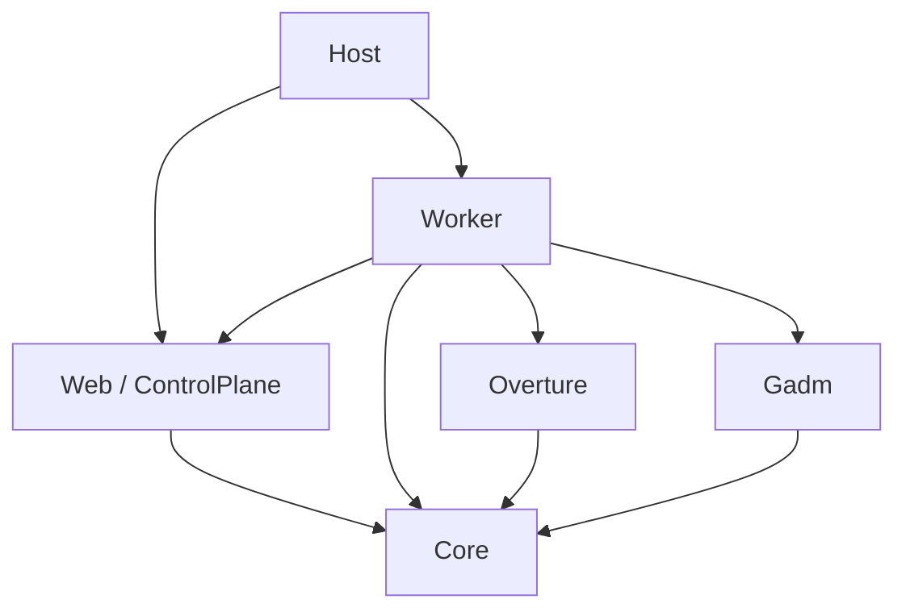

# Architecture overview

Immich ReverseGeo uses a long-lived Web control plane and short-lived heavy execution. The control plane owns admission, settings, UI state and process supervision. Each worker owns one job's geographic services and resources. Run-once composes the heavy processing path directly for an external scheduler. The [operator overview](../website/architecture.md) explains the deployment model without internal protocol details.

This guide is the source navigation entry point. Exact wire, exit, cancellation and telemetry contracts live in [Worker architecture and protocol](WORKER_ARCHITECTURE_PROTOCOL.md).

## Projects and dependency direction

| Project | Responsibility and useful entry point |
|---|---|
| [Host](../../src/ImmichReverseGeo.Host/) | Runnable application; [Program.cs](../../src/ImmichReverseGeo.Host/Program.cs) selects the composition root before host startup |
| [Core](../../src/ImmichReverseGeo.Core/) | Shared lightweight models, role selection, processing/job contracts and protocol rules; no geodata or database-driver package references |
| [Web](../../src/ImmichReverseGeo.Web/) | Razor UI, configuration, repositories, scheduling, job clients and process supervision; builds as `ImmichReverseGeo.Web.ControlPlane` |
| [Worker](../../src/ImmichReverseGeo.Worker/) | Heavy composition, executor, Lookup and cache job handlers, protocol host and direct Run-once host |
| [Overture](../../src/ImmichReverseGeo.Overture/) | Country and administrative matching, airport infrastructure, downloads and exports using Overture data |
| [Gadm](../../src/ImmichReverseGeo.Gadm/) | Optional administrative-boundary download, export, cache and lookup services |
| [Legacy](../../src/ImmichReverseGeo.Legacy/) | Retained reference implementations, outside the active production composition |

The following arrows are **actual project references**, not process launches or DI registrations:

Worker still references the Web library to reuse shared configuration and repository services. Several Worker sources retain `ImmichReverseGeo.Web.*` namespaces. Follow the physical project and its composition root when deciding ownership; a namespace alone does not identify the running process. Worker composition excludes Web presentation and control ownership even though that assembly reference exists.

The reverse edge is forbidden: the Web project references Core, not Worker, Overture or Gadm. Its permitted service dependency closure excludes heavy execution, spatial indexes and native geodata activation. Merely deferring a forbidden factory is insufficient. The [boundary policy](web-control-plane-boundary.md) checks package/project/assembly dependencies, registrations and factories, with runtime sentinels for forbidden initialization.

Host deliberately references both sides to dispatch them. Publish [Host.csproj](../../src/ImmichReverseGeo.Host/ImmichReverseGeo.Host.csproj) to produce the runnable `ImmichReverseGeo.Web.dll`; the Web project itself is now a library. The [Dockerfile](../../src/ImmichReverseGeo.Web/Dockerfile) packages the complete application and bundled data. Data-export utilities remain separate developer tools.

## Composition roots

| Selected role | Root | Runtime ownership |
|---|---|---|
| Standard | [Web composition](../../src/ImmichReverseGeo.Web/Composition/WebServiceCollectionExtensions.cs) | Web UI, scheduled checks, manual controls and temporary worker clients |
| Web-only | Same Web composition with scheduler registration omitted | Same UI and manual/heavy job clients; saved schedule remains intact |
| InternalWorker | [Worker composition](../../src/ImmichReverseGeo.Worker/Composition/InternalWorkerServiceCollectionExtensions.cs) | One private protocol job and the heavy services it needs; no Web listener or recursive launch |
| Run-once | [Run-once composition](../../src/ImmichReverseGeo.Worker/Composition/RunOnceServiceCollectionExtensions.cs) | One direct processing attempt; no Web listener, child, scheduled precheck or internal retry |

The public modes are startup choices described in [Deployment Modes](../website/deployment-modes.md). InternalWorker is controller-owned and is not an additional operator deployment mode. The complete published artifact is reused when Web launches a child.

## Trace the main flows

### Manual and scheduled processing

1. A manual trigger or the Standard [schedule loop](../../src/ImmichReverseGeo.Web/Services/ProcessingSchedule.cs) requests processing. A scheduled check first asks whether current eligible work exists; this observation neither counts nor reserves assets.
2. The Web control plane admits the job through [local arbitration](../../src/ImmichReverseGeo.Web/Services/CoordinateLookupAdmission.cs). A conflicting request is Busy immediately; there is no background queue or automatic replay.
3. The [invocation builder](../../src/ImmichReverseGeo.Web/WorkerCommandInvocation/WorkerCommandInvocation.cs) selects the trusted application artifact. [ChildWorkerLauncher](../../src/ImmichReverseGeo.Web/ChildWorkerLaunching/ChildWorkerLauncher.cs) starts and supervises the child and its streams.
4. After readiness and request validation, worker-side processing acquires the PostgreSQL advisory lock. [ProcessingRunExecutor](../../src/ImmichReverseGeo.Worker/Services/ProcessingRunExecutor.cs) resolves eligible assets in batches through the configured sources and persists complete results.
5. Validated events update [ProcessingState](../../src/ImmichReverseGeo.Web/Services/ProcessingState.cs) and the Web status view. Absolute progress may be coalesced; terminal and lossless events preserve ordering.
6. Settlement joins native exit, output drains, accepted-event delivery and resource disposal before releasing admission. A wire terminal is not proof that the process has finished cleanup.

[ImmichDbRepository](../../src/ImmichReverseGeo.Web/Services/ImmichDbRepository.cs) uses `asset` joined to `asset_exif` on `e."assetId" = a.id`. Current eligibility requires null city and country, non-null latitude and longitude, and a non-deleted asset. The executor also consults skipped tracking. Pagination advances within a pass; it is not a persisted incremental watermark. Batch size limits each query, not the pass.

Standard's [work detector](../../src/ImmichReverseGeo.Web/Services/ProcessingWorkDetector.cs) uses the full current-eligibility `EXISTS` query. The completed watermark research did not introduce an incremental detector, periodic reconciliation or NAS-specific scheduling controls.

### Lookup and cache refresh

The same controller/session lifecycle supports the closed `CoordinateLookup` and `CacheMutation` jobs alongside `ProcessAssets`. [CoordinateLookupOperation](../../src/ImmichReverseGeo.Worker/Services/CoordinateLookupOperation.cs) performs geographic resolution without writing asset metadata. Cache handlers prepare and validate replacement files before publication; failure before publication preserves the previous valid cache. A cancellation observed after publication does not undo that publication.

Cache inventory reads bounded file/schema metadata in Web. Cache deletion and database resets execute in Web under the same local arbitration used by heavy jobs. These exceptions do not authorize loading geographic indexes into the control plane.

### Direct Run-once

[RunOnceApplication](../../src/ImmichReverseGeo.Worker/RunOnce/RunOnceApplication.cs) loads saved settings and owns one direct processing attempt through cleanup. It uses the processing lock and heavy services without the child protocol transport. Automation consumes its documented exit code; the caller owns any later retry or schedule.

## State, failure and concurrency boundaries

Persistent ownership is documented in the [operator storage table](../website/architecture.md#persistent-data-and-temporary-state). Web progress, recent in-app logs and retained status are process-local observations. They are not a durable job queue or recovery journal.

Two exclusion mechanisms solve different problems: local arbitration covers heavy jobs and coordinated maintenance in one Web process; the database advisory lock excludes concurrent processing against the same Immich database. It does not turn cache deletion, Lookup or resets into distributed transactions. Separate containers and direct writers require operator coordination during maintenance.

Cancellation keeps ownership until cleanup settles. Workers do not retry or restart themselves, and the Web does not fall back to an in-process resolver. Partial durable effects remain after failure. Consult the [finality and cancellation reference](WORKER_ARCHITECTURE_PROTOCOL.md#managed-exits-and-parent-finality) before changing stop or retry behavior.

## Verification and further reading

| Change area | Start with |
|---|---|
| Project references, DI registrations or startup | [Application composition tests](../../tests/ImmichReverseGeo.Tests/ApplicationComposition/) and [boundary policy](web-control-plane-boundary.md) |
| Job contracts or protocol handling | [Worker jobs](../../tests/ImmichReverseGeo.Tests/WorkerJobs/) and [protocol compatibility](../../tests/ImmichReverseGeo.Tests/WorkerProtocol/Compatibility/) |
| Child lifetime, cancellation or recovery | [Child launching tests](../../tests/ImmichReverseGeo.Tests/ChildWorkerLaunching/) and [process failure matrix](../../tests/ImmichReverseGeo.Tests/WorkerProcessFailureMatrix/) |
| UI progress delivery | [Worker event delivery](worker-event-delivery.md) |
| Image startup and modes | Canonical `npm run test:docker-smoke`; see [evidence producers](WORKER_ARCHITECTURE_PROTOCOL.md#evidence-producers-and-verification) |
| Repeated-worker memory and cleanup | Optional [memory soak](worker-memory-soak.md); distinguish fixture observations from deployed-container measurements |
| Release claims and rollback | [Release checklist](RELEASE_CHECKLIST.md); retain image, platform and fixture identities |

Use the repository test runner described in [CONTRIBUTING](../../CONTRIBUTING.md). Keep generated logs and evidence under `_out/`, and update operator instructions in the same change when behavior changes. The [maintainer index](README.md) links the remaining data-source and scheduling investigations.
