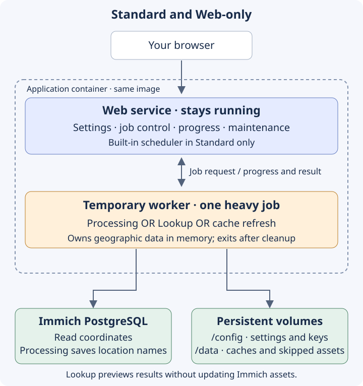

# Architecture

Immich ReverseGeo separates the Web interface from the work that loads geographic data. The Web service stays available for settings, progress and maintenance; a temporary worker process handles each processing pass, coordinate Lookup or cache refresh. Both come from the same application image, so you do not deploy or manage a separate worker service.

!!! info "Release availability"
    This page describes the worker architecture in the [Unreleased changes](./changelog.md#unreleased). Use an image release that includes it; a mutable published tag may still contain the older architecture.

## Processes and deployment modes

The diagram shows the main heavy-job flow. Web controls also read settings, database statistics and lightweight cache metadata, and perform coordinated maintenance directly.

| Mode | What stays running | Where heavy work happens |
|---|---|---|
| Standard | Web UI and built-in scheduler | A temporary child process for each admitted job |
| Web-only | Web UI with manual controls | The same temporary child processes; no internal scheduler |
| Run-once | Nothing after the attempt finishes | Directly in the invoking process, with no Web listener or child worker |

Choose a mode and copy the supported commands from [Deployment Modes](./deployment-modes.md). The mode is selected at startup; it is separate from your saved processing settings.

## Main components

| Component | Responsibility |
|---|---|
| Web service | Settings, scheduling in Standard, job admission, progress, logs, cache inventory and coordinated maintenance |
| Temporary worker | One processing, Lookup or cache refresh job, including the geographic indexes and native libraries it needs |
| Immich PostgreSQL | Existing assets and GPS coordinates; saved `city`, `state` and `country` values |
| Bundled geographic data | Country detection and airport matching, shipped with the image |
| Downloaded country caches | More detailed Overture and optional GADM administrative areas, reused from persistent storage |

The worker is a child process inside the application container, not an additional container. When it exits, its process memory is released. Container memory can still include the Web service and filesystem cache; this architecture does not establish a RAM limit or a guaranteed reduction in total memory. See [memory and disk activity](./deployment-modes.md#startup-memory-and-disk-activity).

## Processing pipeline

An admitted processing attempt:

1. Acquires the processing lock for the Immich database. If another processing pass owns it, this attempt does no processing.
2. Reads batches of currently eligible GPS-tagged assets. A batch is a portion of a pass, not a limit on the whole run.
3. Detects the country using bundled country polygons.
4. Resolves state and city from cached Overture divisions and, if enabled, optional GADM data. Missing country caches are prepared on demand.
5. Applies the configured airport and city-selection rules.
6. Writes complete location results to Immich and tracks assets that should be skipped on later passes.
7. Finishes output and resource cleanup before releasing the active job's local slot.

An eligible asset has GPS coordinates, is not deleted, and has both city and country unset. Existing location names need a deliberate [reset](./using-the-app.md#resetting-immich-location-data) before reprocessing; clearing selected items does not limit the next pass to those items.

Lookup uses the geographic resolution path as a preview: it can prepare caches but does not write location values to an Immich asset. Use [Lookup first](./using-the-app.md#lookup) to check a result before changing processing settings. [Data Sources](./data-sources.md) explains source ordering, coverage and the non-commercial restriction on optional GADM data.

## Persistent data and temporary state

| Location | Contents | What survives a worker or container restart |
|---|---|---|
| `/config` volume | `settings.json` and Web data-protection keys | Saved settings and keys, when the same volume is mounted |
| `/data` volume | Overture and GADM country caches, `skipped.db` and working files | Published caches and skipped-asset tracking |
| Application image | Executable, libraries, bundled country/airport data and default rules | Replaced together when you change the image |
| Immich PostgreSQL | Asset metadata | Committed location updates, including updates from a later cancelled or failed pass |
| Web process memory | Current progress, recent in-app logs and retained worker status | These are not a durable job history; a Web restart begins with fresh status |

Database credentials come from the container environment, not `settings.json`. Keep `/config` and `/data` as separate writable volumes. See [Configuration](./configuration.md#data-layout) for their directory layout and [Upgrading and Rollback](./upgrading.md) for backup and recovery steps.

## Worker jobs and multiple containers

Within one Web process, processing, Lookup, cache refresh, cache deletion and database maintenance share one exclusive work slot. A conflicting request reports Busy immediately; it is not queued. Inventory and status reads do not load geographic datasets.

Stopping a worker requests cancellation and waits for its exit, output handling and cleanup. If cooperative stopping does not finish within the grace period, the controller can stop the process tree. Already committed database changes and published caches remain. Failed jobs are not automatically replayed, and a worker failure does not switch heavy execution into the Web process. Follow the [status and recovery guide](./deployment-modes.md#worker-status-and-recovery) before retrying.

The local slot is **not shared between containers**. A PostgreSQL advisory lock additionally excludes concurrent asset-processing passes against the same Immich database, including Run-once. It does not coordinate Lookup, cache maintenance or database resets across containers. For maintenance that needs strict exclusion, keep one interactive Web container and pause external jobs and other writers that share its database or volumes.

## Active and legacy sources

Overture country, administrative-area and airport data, plus optional GADM administrative data, form the active geographic path. Live Overture Places is an optional Lookup diagnostic. Older geoBoundaries, static-airport and Foursquare implementations remain in the repository's Legacy project and are outside the active runtime.
